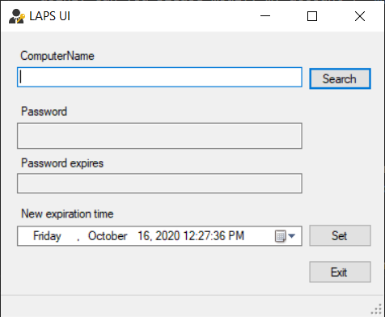
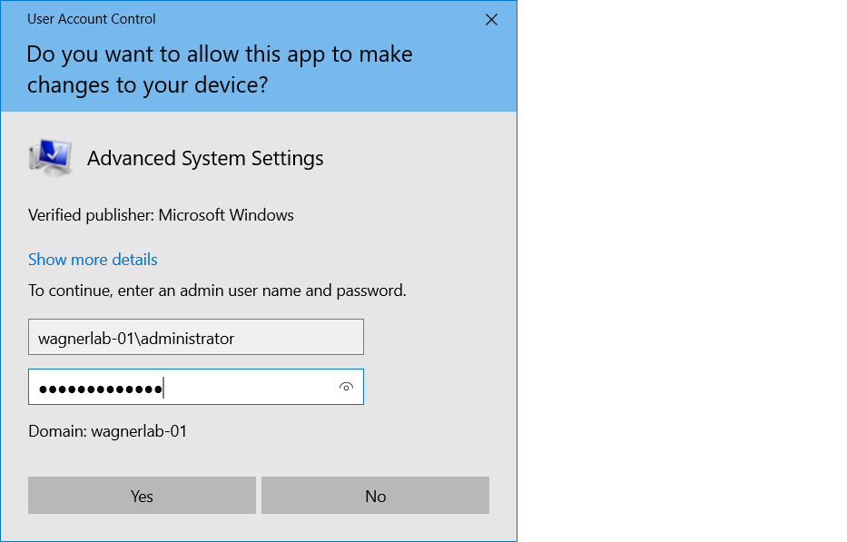

# Elevate to Administrator on a Local Lab Workstation or Desktop

## Document info

| Last update | Author         | Notes or changes                    |
|-------------|----------------|-------------------------------------|
| 2020/10/16  | Wagner         | Initial creation                    |


## Operating System(s) and requirements
* Windows 10

## Purpose
* Obtain temporary admin rights on your workstation to install software or change protected settings

## Procedure

Before following this procedure, make sure that the action you're planning to take that requires admin rights:
    * Is for lab-related business and required for your research
    * Does not compromise the security of your computer or the UW network (if you don't know why you're being asked for admin, don't grant it!)
    * Is aligned with terms of acceptable use issued by the deparment IT staff, the college, and the university
    * Would not be embarassing for you or your lab group if it showed up on the news

0. **Ensure you are approved to use admin rights.** Try this procedure, and if it fails, you may need to contact [Joshua Jankowski](mailto:joshua.jankowski@wisc.edu) to grant you the proper permissions. Copy your advisor on any emails.

1. If you are off-campus, **Set up VPN access**
    * Follow the links to [install and configure VPN](https://kb.wisc.edu/cae/5573), and to [activate VPN access](https://kb.wisc.edu/cae/page.php?id=23424)

    * _Undergrad researchers_ must request full VPN access that is not granted by default. Send an email based on the following template to the [CAE helpdesk](mailto:helpdesk@cae.wisc.edu) and **copy your advisor**
        > I am an undergraduate research working with **(name of advisor)** who is copied on this email and need to have VPN rights to allow for remote desktop connection to a lab computer that I will be using. Can you please modify my account (**myemail@wisc.edu**) to provide full or split VPN access?

    * Connect to VPN with your NetID and password

        

2. **Locate your computer name**. 
    * Right click on the Windows start menu icon
    * Click "System"
    * Locate the "Device Name". This is your computer name. 
    * Note that the computer's network name is <device name>.ad.engr.wisc.edu

    

3. In the Windows start menu, search for "LAPS UI" and launch the app.

    

    * Enter the computer name as it appears from step 2 and click "Search". A password and expiration date should appear. 
    * If the dialog returns a message that the computer name is ambiguous, you may need to enter the full device name string with all attributes. To do this, copy the following text and paste the full string into the name field, replacing the computer name after 'CN' with your computer name from step 2.
      ```
      CN=WAGNERLAB-01,OU=Grad,OU=Wagner Lab,OU=Mechanical Engineering,OU=orgUnits,DC=ad,DC=engr,DC=wisc,DC=edu
      ```

4. Execute the command requiring admin rights. This can be done by:
    * Right clicking an object, then select "Run as administrator" if available
    * Running the process that automatically prompts for admin rights

6. When prompted for your admin credentials, enter:
    * For username: "computer name\administrator"
    * For password, the password given by LAPS

            

7. Complete the task. Admin rights will automatically relinquish after the task completed or the application closed. 
