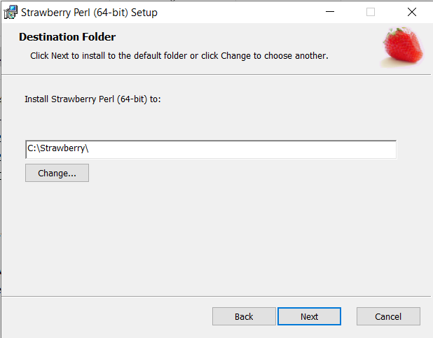
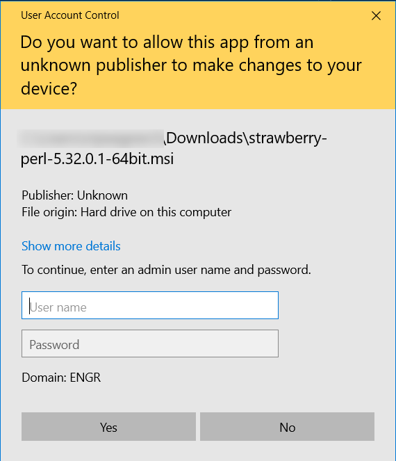
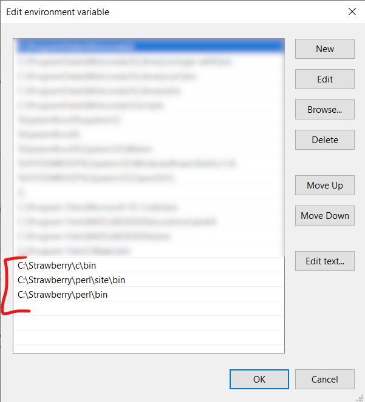
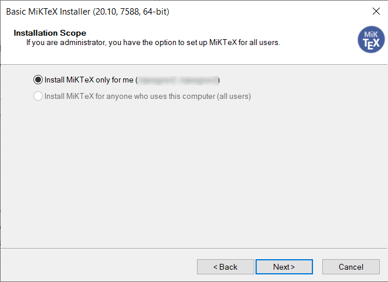
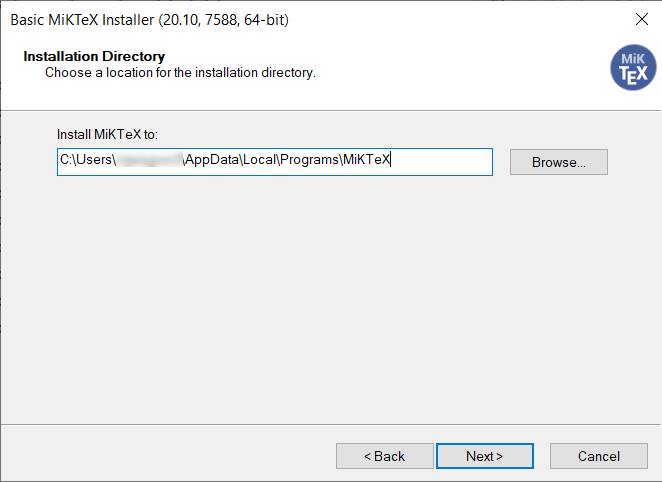
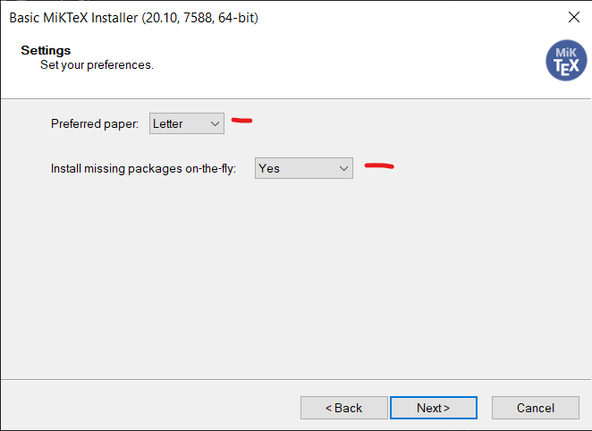
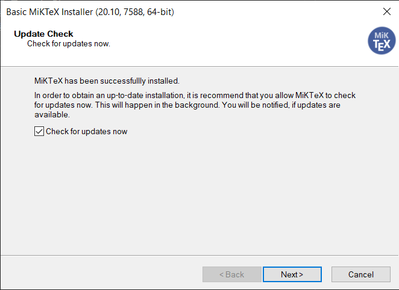
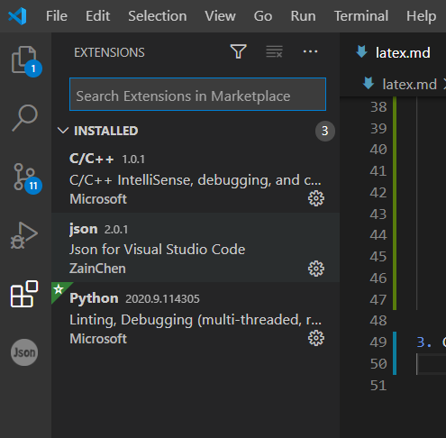
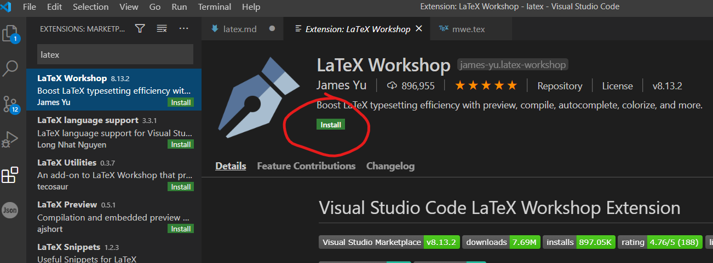
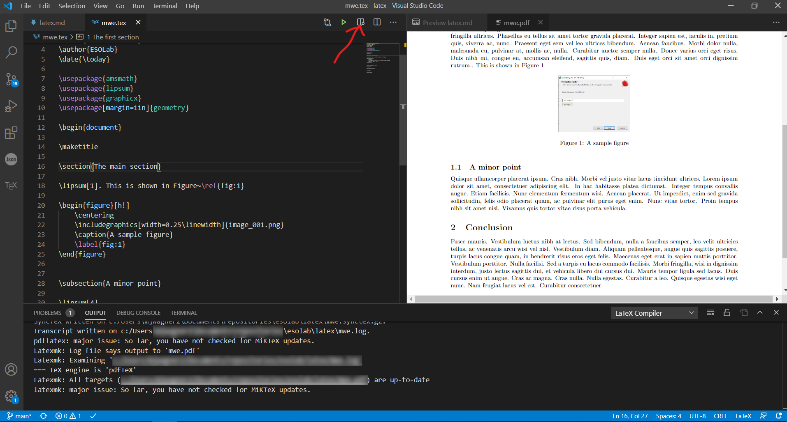

# LaTeX installation and configuration with VS Code

## Document info

| Last update | Author         | Notes or changes                    |
|-------------|----------------|-------------------------------------|
| 2020/10/16  | Wagner         | Initial creation                    |

## Operating System(s) and requirements
* Windows 10
* The preferred LaTeX IDE is [VS Code](https://github.com/mjwagner2/esolab/blob/main/vscode/vscode.md)

## Purpose
* Install a LaTeX compiler using the MikTex distributable option, and configure VS Code to edit, compile, and view LaTeX documents.
* Provide links to useful LaTeX templates

## Procedure

### Windows 10

1. **Download Perl prerequisite** that is required for VS Code integration. The best current option is [Strawberry Perl](http://strawberryperl.com/), using the 64-bit MSI.
    * Run the MSI installer without admin rights. 
    * Choose any convenient installation directory

        

    * The installer may prompt you for admin rights. [Elevate to admin]() to continue.
    
        

    * Finish

    * To check that the install was successful, you should see several Perl paths in your system environment variables under `System Variables -> Path`:
    
        

2. **Download the MikTex distributable.** This provides several LaTeX compilers, including pdflatex, bibtex, and others. 
    [https://miktex.org/download](https://miktex.org/download)

    * Run the installer without admin rights.

    * Navigate through the prompts, choosing the correct options as follows:
    
        
        
        
        
        
        
        

3. Configure VS Code
    * Open VS Code, and open the Extensions tab (Ctrl+Shift+x)
    
        

    * Search for "latex". Install LaTeX Workshop
        

    * Open a LaTeX file such as [this minimal example](https://github.com/mjwagner2/esolab/blob/main/latex/mwe.tex). 

    * Type ``CTRL+ALT+B`` to build the document. The build may take a few moments the first time as the MikTex package manager updates packages. You should be connected to the internet the first time you build or when using packages that have not been imported before. When building, a small cycling circle will appear on the status bar at the bottom of the window.

    * You can view the resulting PDF in VS Code. Click the small icon in the upper right of the editor as shown below.
    
        

    * Here are some tips to keep in mind:
        * When editing code, the document will compile each time you save a file.
        * You can sync the position of the PDF with the current position of your cursor in the .tex file by typing ``CTRL+ALT+J``
        * You can open the PDF view by typing ``CTRL+ALT+V``
        * You can force a rebuild by typing ``CTRL+ALT+B``
        * You can locate the cursor in the .tex file by holding ``CTRL`` and clicking a position in the PDF
        * Google is your friend. Use Google to learn commands, packages, and debug problems. When in doubt, copy the error and Google it!

## Templates and Examples

(To be provided soon...)

* Quarterly report for a funding agency
* Technical presentation
* Journal paper
* Homework writeup
