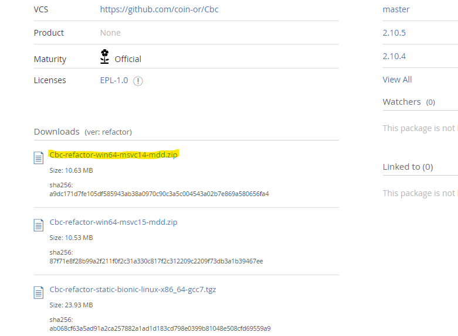
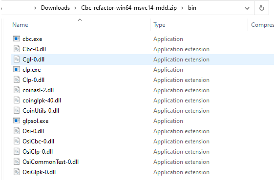
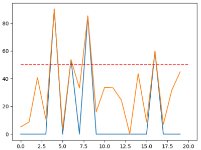

# Configuring Python for Pyomo 

## Document info

| Last update | Author         | Notes or changes                    |
|-------------|----------------|-------------------------------------|
| 2020/10/13  | Wagner         | Initial creation                    |


## Operating System(s) and requirements
* Windows 10
* Python 3.8+ (miniconda)
* This procedure assumes prior installation of [Python](https://github.com/mjwagner2/esolab/blob/main/python/python.md)
* You may also want to install [VS Code](https://github.com/mjwagner2/esolab/blob/main/vscode/vscode.md)
* [Source code](https://github.com/mjwagner2/esolab/blob/main/pyomo/mwe.py) for minimal working example

## Purpose
Configure Python 3+ installed on a local machine to be used with Pyomo, which is a optimization modeling language developed for compatibility with multiple open-source and commercial solvers, including CPLEX, Gurobi, GLPK, CBC, and others. 

## Procedure

### Windows 10
1. **Download binaries for the appropriate solver.** These are used by Pyomo when solving the optimization problem
    1. CBC (COIN-OR): 

        The direct link for the most recent download as of this date is [here](). The link to the Bintray webpage is [here](https://bintray.com/coin-or/download/Cbc). Locate the most recent distributable that is compatible with your system. For example:

        

    1. GLPK (tbd)

2. **Extract download files to a temporary folder.** You may not need to use all of the subfolders or extracted files.

3. **Locate the executable (.exe) and dynamic link library (.dll) files**, likely in a "bin" folder. These are the binary files that execute the solver. The CBC solver files are located in the /bin/ folder as shown below:
    

4. **Copy the binaries to the Python Scripts folder.** Navigate to your Python installation folder. This may be:
    `C:\ProgramData\Miniconda3\Scripts\`  
    `C:\Python38\Scripts\`

    You can locate the python installation folder by opening a command window and executing:  
    `> where python`

5. **Install Pyomo.** Pyomo is best installed via `pip` or `conda` in the command window. 
    1. Open a command window (with admin rights, if you installed Python using admin rights). 

    2. Install Pyomo. You can refer to the [Pyomo documentation](https://pyomo.readthedocs.io/en/stable/installation.html) for the most recent instructions.    
        `>conda install -c conda-forge pyomo`

        Hit `[y]` when prompted to continue.


6. **Test your installation.**
    Create a new python file where we'll test whether the solver is working appropriately. Paste the following minimal working example into the solver:

    ```
    import pyomo.environ as pyomo
    import random 
    import matplotlib.pyplot as plt

    # Create a model
    model = pyomo.ConcreteModel()

    # Time series
    model.nt = pyomo.Param(initialize = 20)
    model.T = pyomo.Set(initialize = range(model.nt()))

    # Create some random input data
    xtmp = {}
    random.seed(123)
    for t in range(model.nt()):
        xtmp[t] = random.uniform(0,100)

    # Assign parameter values
    model.X_in = pyomo.Param(model.T, initialize=xtmp)
    model.XM = pyomo.Param(initialize=max(xtmp.values()))
    model.X0 = pyomo.Param(initialize=50)

    # setup an array of continuous and binary variables over the time domain
    model.x = pyomo.Var(model.T, domain=pyomo.NonNegativeReals)
    model.y = pyomo.Var(model.T, domain=pyomo.Binary)

    # Maximize x 
    def f_objective(model):
        return sum([model.x[t] for t in model.T])
    model.objective = pyomo.Objective(rule = f_objective, sense = pyomo.maximize)

    # ---Add some constraints

    # x[t] less than X_in for all t
    def f_x_lim(model, t):
        return model.x[t] <= model.X_in[t]
    model.c_x_lim = pyomo.Constraint(model.T, rule = f_x_lim)

    # x[t] is limited by value of binary y[t]
    def f_x_y(model, t):
        return model.x[t] <= model.XM()*model.y[t]
    model.c_x_y = pyomo.Constraint(model.T, rule = f_x_y)

    # y[t] can only be 1 when X_in[t] > X0
    def f_y_x0(model, t):
        return model.y[t] <= model.X_in[t] / model.X0
    model.c_y_x0 = pyomo.Constraint(model.T, rule = f_y_x0)

    # ------ solve and print out results
    #solver setup
    #solver = pyomo.SolverFactory('glpk')
    solver = pyomo.SolverFactory('cbc')
    res = solver.solve(model)

    print(res)
    print(model.objective())

    # Space-separated list of variables to print
    pouts = "X_in x y".split()

    # Automatically handle printing
    print('t\t'+'\t'.join(pouts))

    for t in model.T:
        fmt = "{:d}" + "\t{:.1f}"*(len(pouts))
        outs = []
        for o in pouts:
            try:
                outs.append(model.__getattribute__(o)[t]() )
            except:
                outs.append(model.__getattribute__(o)[t] )
        print( fmt.format(*([t]+outs)) )

    plt.plot([mt for mt in model.T], [mx() for mx in model.x.values()], \
            [mt for mt in model.T], [mx for mx in model.X_in.values()], \)
            [0, model.nt()], [model.X0(), model.X0()], 'r--')
    plt.show()
    ```

    You should get something that qualitively looks like the following. The program considers input (orange) values, and maximizes output values (blue) while requiring that any value below the minimum threshold (the red dotted line at 50, in this case) be forced to zero by the binary variable:   

    

