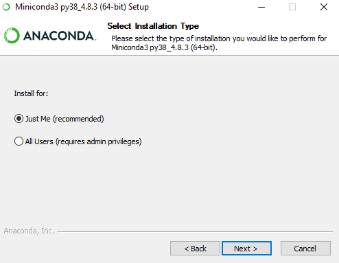
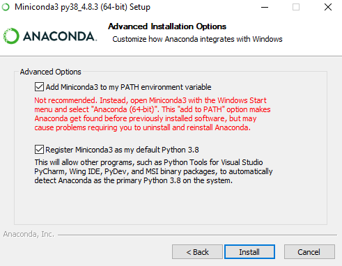

# Python Installation & Setup for Students

## Document info

| Last update | Author         | Notes or changes                    |
|-------------|----------------|-------------------------------------|
| 2020/10/14  | Wagner         | Moving to markdown format           |
| 2020/10/13  | Springate      | Initial creation                    |


## Operating System(s) and requirements
* These instructions are based on Installation for a Windows 10, 64-bit operating system. 

## Purpose
Installs Python 3+ on a local machine.

## Procedure

1.	Visit [this page](https://docs.conda.io/en/latest/miniconda.html) to download Miniconda, a free minimal installer for Conda Python.

2. Choose the appropriate option for your system.

    

3. A file named “Miniconda3-latest-Windows-x86_64” will start downloading. 

    

4.	Double click the installer to begin the installation process. 
    * Select “I Agree”
    * Select “Just Me” for Installation Type 

        
    
    * Select default location for Install Location

        

    * Select all boxes for Advanced Installation Options

        

    * Install
    * Finish

5. Install Common Python Packages

    * Open Command Prompt
    * Follow the commands in the window below to install commonly-used packages. Type “y” to proceed when prompted. 
        ```
        > conda install numpy
        > conda install pandas
        > conda install scipy
        > conda install matplotlib
        ```
        
    * For projects that require NREL's [PySAM](https://sam.nrel.gov/software-development-kit-sdk/pysam.html) package, add the NREL channel and the PySAM package:
        ```
        > conda config --env --append channels nrel
        > conda install nrel-pysam nrel-pysam-stubs
        ```
