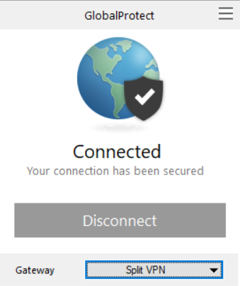
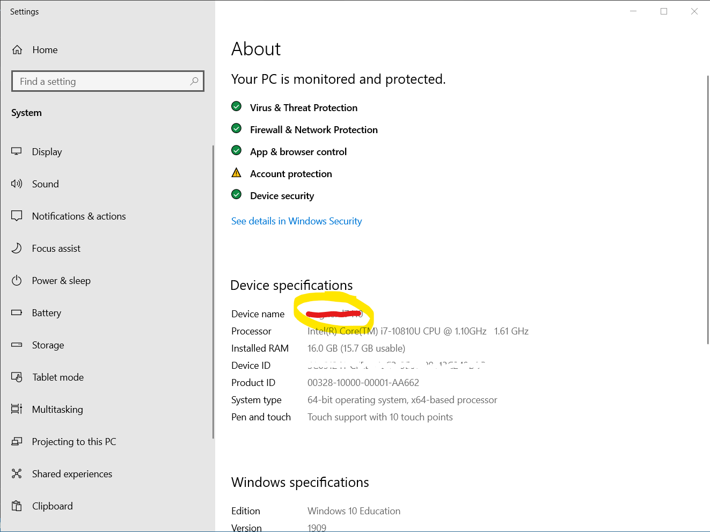
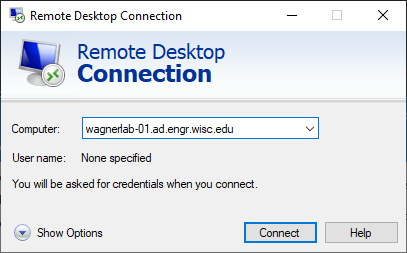
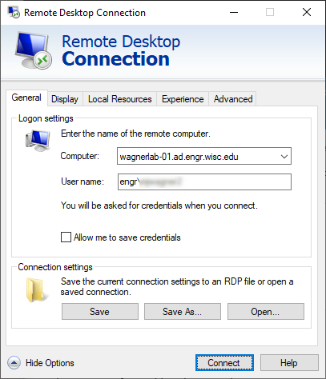
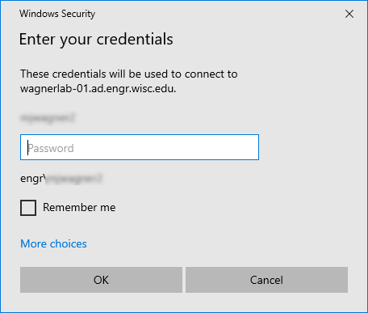

# Connect to a Lab Desktop Remotely

## Document info

| Last update | Author         | Notes or changes                    |
|-------------|----------------|-------------------------------------|
| 2020/11/5  | Wagner         | Initial creation                    |

## Operating System(s) and requirements
* Windows 10

## Purpose
* Access your lab computer remotely

## Procedure

1. **Ensure you are approved to use remote desktop.** You must be approved for connection to a specific lab computer. You may need to contact [Joshua Jankowski](mailto:joshua.jankowski@wisc.edu) to grant you the proper permissions. Copy your advisor on any emails.

2. If you are off-campus, **connect to VPN**
    * If you haven't already, follow the links to [install and configure VPN](https://kb.wisc.edu/cae/5573), and to [activate VPN access](https://kb.wisc.edu/cae/page.php?id=23424)

    * _Undergrad researchers_ must request full VPN access that is not granted by default. Send an email based on the following template to the [CAE helpdesk](mailto:helpdesk@cae.wisc.edu) and **copy your advisor**
        > I am an undergraduate research working with **(name of advisor)** who is copied on this email and need to have VPN rights to allow for remote desktop connection to a lab computer that I will be using. Can you please modify my account (**myemail@wisc.edu**) to provide full or split VPN access?

    * Connect to VPN with your NetID and password

        

2. **Determine the remote computer name**. 
    * Option 1: check with your advisor
    * Option 2: look up the computer name when you're on campus
        * Right click on the Windows start menu icon
        * Click "System"
        * Locate the "Device Name". This is your computer name. 
        * Note that the computer's network name is <device name>.ad.engr.wisc.edu

    

3. In the Windows start menu, search for "Remote Desktop" and launch the app.

    

    * Expand the dialog to show more options

4. Enter the connection information:

    * Specify the computer network address, which is the computer name followed by `.ad.engr.wisc.edu` (e.g., `wagnerlab-01.ad.engr.wisc.edu`)
    
    * Enter your computer login, which is  `engr\` followed by your CAE user name (e.g., `engr\myusername`)

    

6. Click connect. When prompted, enter your password

    

